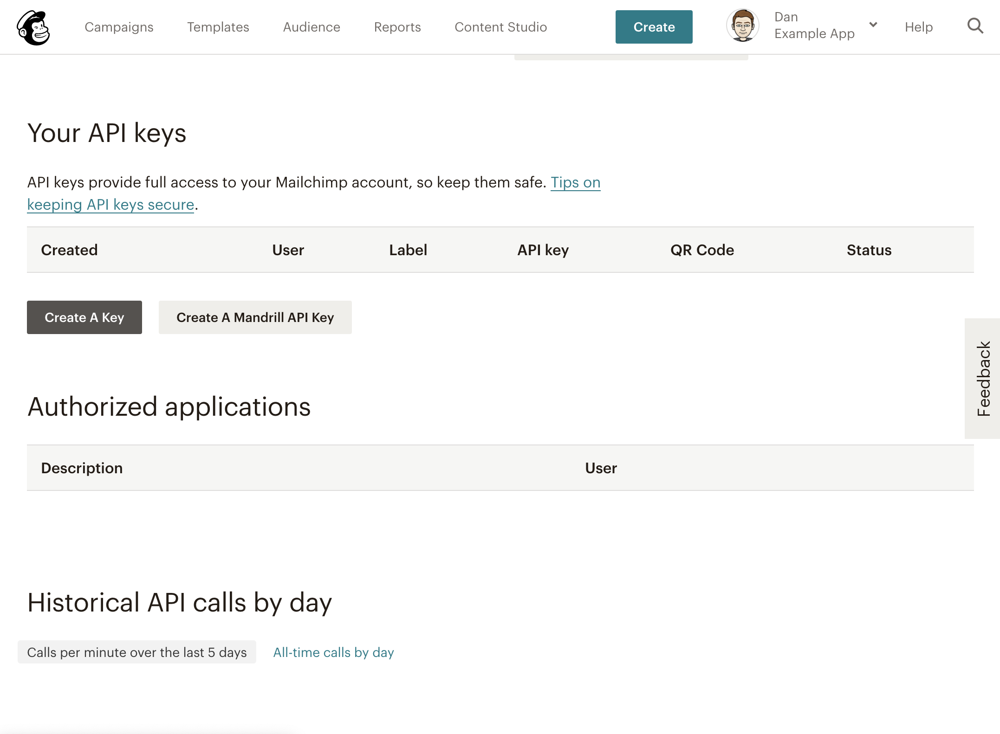
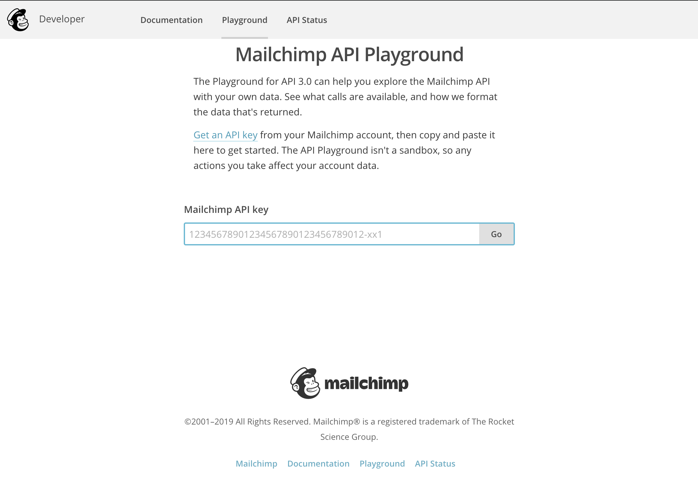
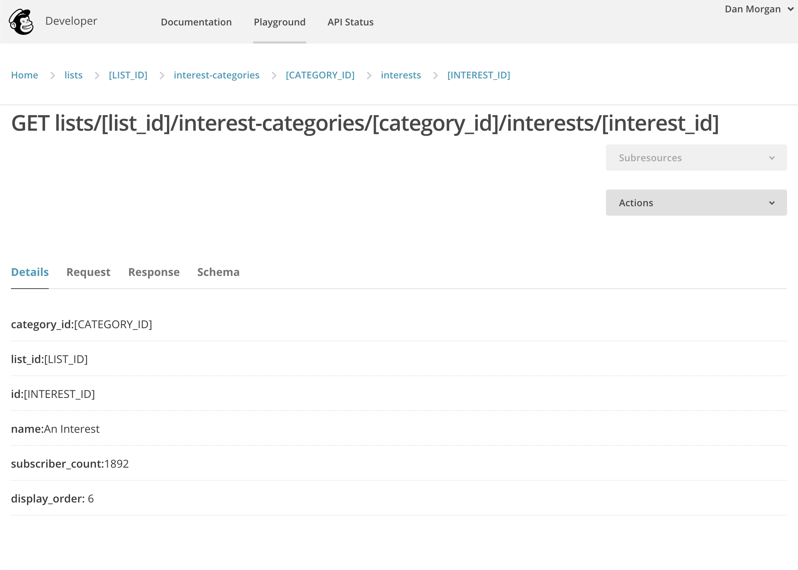

A client recently asked me to update their Mailchimp integration to add support for sub-group targeting using interest groups. Finding the process more involved than I expected, I wanted to share my experience locating the relevant IDs in the admin interface and examples including them in an API request.

## Creating an API Key

In order to create new users using we'll first need to create an API key with access to our account. Sign into Mailchimp then go to the [Account Settings > Extras > API Keys](https://us4.admin.mailchimp.com/account/api/) page then **Create a Key**.



## Finding the Interest ID

Now that we have an API key, we need to find the interest ID. To do that, we'll need to use the [Mailchimp API Playground](https://us1.api.mailchimp.com/playground/). Using the API Key we just created, log into the API Playground and follow the steps below to navigate through the ensuing screens to find the desired interest.



First, select `Lists` then use the Subresources dropdown to select `interest-categories`. Find the relevant category in the list then use the Subresources dropdown again to access `interests`. You should now be presented with the list of relevant interests, click the name of the one we want an ID for and you should arrive on the screen above with all the information we'll need.



## Usage in PHP

Download this [Mailchimp API wrapper](https://github.com/drewm/mailchimp-api/blob/master/src/Mailchimp.php) class, and save it next to our script so it can be found by the `include(./Mailchimp.php)` call on line 7 below.

Next, we need the API Token created in the first section, as well as the List ID and Interest ID from the second. Replace `API_TOKEN`, `LIST_ID`, and `INTEREST_ID` in the constant definitions on lines 2–4.

```php
// Define API config constants
define('MAILCHIMP_API', 'API_TOKEN');
define('MAILCHIMP_LIST', 'LIST_ID');
define('MAILCHIMP_INTEREST', 'INTEREST_ID');

// Include the API Wrapper Class
include('./Mailchimp.php');

use \DrewM\Mailchimp\Mailchimp;

// Instantiate class
$Mailchimp = new Mailchimp(MAILCHIMP_API);

// grab email address from request
$email = $_REQUEST['email'];
$result = '';

// if there's an address make the request to mailchimp, store the response
if ($email != '') {
  $result = $Mailchimp->post("lists/" . MAILCHIMP_LIST . "/members", array(
    'email_address' => $email,
    'status' => 'subscribed',
    'interests' => array(MAILCHIMP_INTEREST => true),
  ));
}

// return status
echo json_encode($result);
```

## Update: Usage in Node.js

Since writing the original version of this post, I was asked to implement similar functionality for a static site deployed to Netlify. Using the same method for locating the necessary API information described above, [see here](https://github.com/xdmorgan/netlify-functions/tree/master/functions/mailchimp-subscribe) for a drop-in Node-based Lambda function solution.

## References & Resources

- [Mailchimp API PHP Class](https://github.com/drewm/mailchimp-api/blob/master/src/Mailchimp.php)
- [StackOverflow: Finding Mailchimp List IDs](https://stackoverflow.com/questions/37311116/can-you-get-a-mailchimp-interest-group-id-without-using-the-api)
