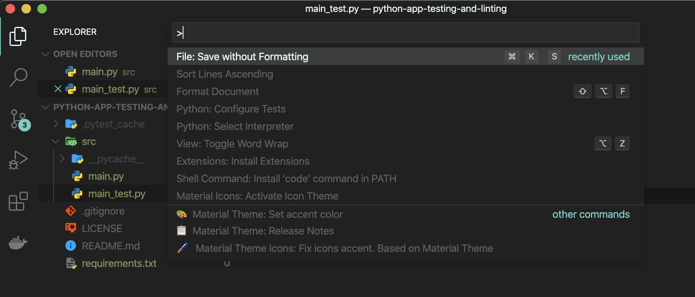
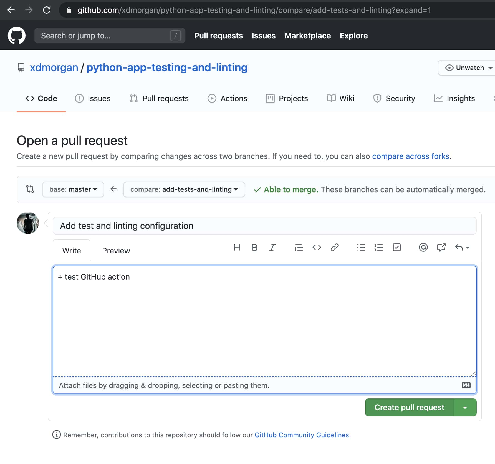
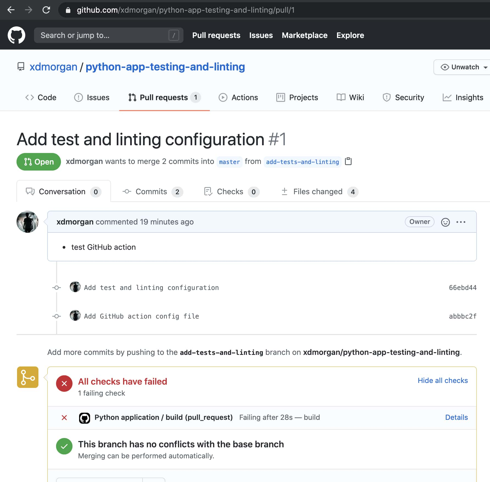
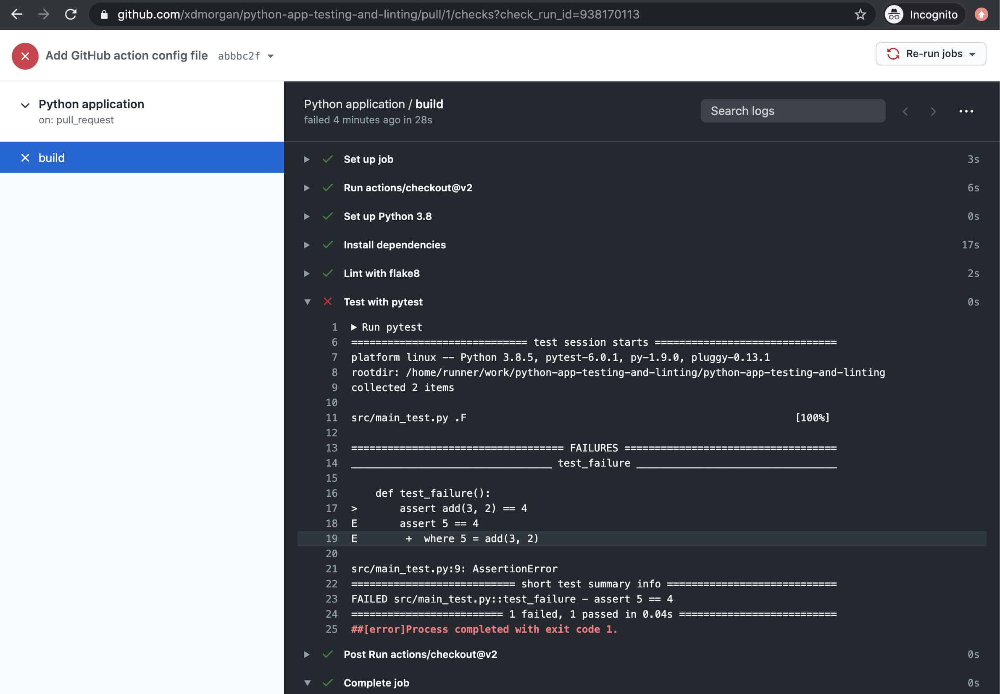
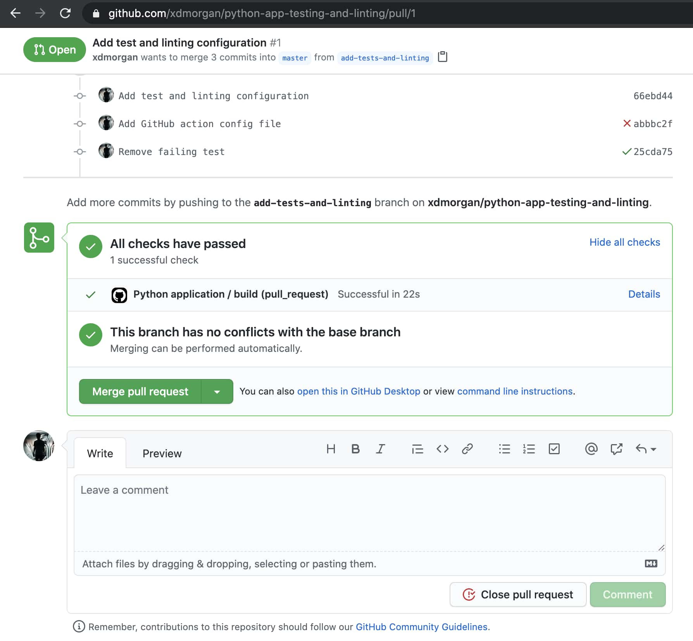

I don't work on Python projects very often, so when I do, I usually need to start from scratch and look up the latest (read: easiest) way to setup automated tests and linting. Luckily, open-source libraries and continuous integration platforms have made the process quick and free. After testing a few different combinations, I've found a solution that works well for me and I hope you'll find it similarly helpful.

First, we'll configure Pytest and Flake8 in our application. Second, we'll integrate those into our local git workflow using git hooks (via pre-commit). Third, we'll mirror our local testing in a GitHub Action which will run against pull requests and ensure no wonky code makes it into our main branch.

## Prerequisites

In order to dive right in, you'll need to have Python3, a local git repo, and a remote GitHub repo. If you have those already, skip ahead to [the next section](#install-dependencies).

- **Python 3**: To check whether Python 3.x is installed, run `which python3` in terminal. If the command is not found, follow [the official guide](https://www.python.org/downloads/).
- **GitHub repo**: If needed, [create a GitHub repo](https://github.com/new).
- **Local repo**: If you're starting from scratch, clone the GitHub repo created in the step above. If you already have a local project but haven't linked your remote git repo, see the [GitHub docs](https://docs.github.com/en/github/importing-your-projects-to-github/adding-an-existing-project-to-github-using-the-command-line) for steps.

## Install Dependencies

In the root of your project, create a `requirements.txt` file and add `pytest`, `flake8`, and `pre-commit` project dependencies:

```txt
####### requirements.txt #######
pytest
flake8
pre-commit
```

Next, run the following command to install with pip:

```bash
python3 -m pip install -r requirements.txt
```

## Run Test Command

After installing Pytest and Flake8, create a sample test to ensure everything is working as expected. First, create `src/main.py` and add a sample function:

```py
# main.py
def add(a, b):
    return a + b
```

Next, create `src/main_test.py` and add the following test assertion:

```py
# main_test.py
from main import add

def test_success():
    assert add(2, 2) == 4
```

We're now ready to run the test suite. In terminal, you should see a success message when running the following command:

```bash
➜  pytest
========================== test session starts ==========================
platform darwin -- Python 3.7.5, pytest-5.3.2, py-1.8.1, pluggy-0.13.1
rootdir: /Users/dan/projects/python-app-testing-and-linting
collected 1 item

src/main_test.py .                                                [100%]

=========================== 1 passed in 0.01s ===========================
```

Before continuing, add an intentionally failing test to ensure it is also picked up by the `pytest` command. You should now see something like following:

```bash
➜  pytest
========================== test session starts ==========================
platform darwin -- Python 3.7.5, pytest-5.3.2, py-1.8.1, pluggy-0.13.1
rootdir: /Users/dan/Sites/experiments/python-app-testing-and-linting
collected 2 items

src/main_test.py .F                                               [100%]

=============================== FAILURES ================================
_____________________________ test_failure ______________________________

    def test_failure():
>       assert add(3, 2) == 4
E       assert 5 == 4
E        +  where 5 = add(3, 2)

src/main_test.py:9: AssertionError
====================== 1 failed, 1 passed in 0.06s ======================
```

Before going back and fixing the failing test, leave it as-is in its failing state, we'll come back to it later.

## Run Lint Command

Next we'll identify undesirable formatting within our code. To do so, edit your test file and remove the line-breaks from in-between the sample tests and save.

```py
# main_test.py
from main import add
def test_success():
    assert add(2, 2) == 4
def test_failure():
    assert add(3, 2) == 4

```

If your editor is automatically applying standard formatting as you save, that's great it will make things easy going forwards. That said, for this next example, humor me and bypass it temporarily. If you're using VS Code, select **File: Save without Formatting** from the command palette:



Now run `flake8` in terminal and observe the formatting issues it discovered:

```bash
➜  flake8
./src/main_test.py:2:1: E302 expected 2 blank lines, found 0
./src/main_test.py:4:1: E302 expected 2 blank lines, found 0
```

Instead of going back and fixing the issues, keep reading. We'll setup an automatic Git hook in the next section where they'll serve as a useful example.

## Add Commit Hook

To automatically validate formatting before code is checked-in to version control, we'll set up a pre-commit hook (using the aptly named pre-commit package). In your project root, create `.pre-commit-config.yaml` and add the following:

```yaml
repos:
  - repo: https://github.com/pre-commit/pre-commit-hooks
    rev: v2.3.0
    hooks:
      - id: check-yaml
      - id: end-of-file-fixer
      - id: trailing-whitespace
  - repo: https://gitlab.com/pycqa/flake8
    hooks:
      - id: flake8
```

Next, run pre-commit's install script to add the hook:

```bash
➜  pre-commit install
pre-commit installed at .git/hooks/pre-commit
```

We're now ready to commit the changes in a new git branch and in doing so, test the newly installed hook. To do so, follow the commands below:

```bash
➜  git checkout -b add-tests-and-linting
Switched to a new branch 'add-tests-and-linting'

➜  git add .

➜  git status
On branch add-tests-and-linting
Changes to be committed:
  (use "git restore --staged <file>..." to unstage)
        new file:   .pre-commit-config.yaml
        new file:   requirements.txt
        new file:   src/main.py
        new file:   src/main_test.py

➜  git commit -m "Add test and linting configuration"
Check Yaml...............................................................Passed
Fix End of Files.........................................................Passed
Trim Trailing Whitespace.................................................Passed
flake8...................................................................Failed
- hook id: flake8
- exit code: 1

src/main_test.py:2:1: E302 expected 2 blank lines, found 0
src/main_test.py:4:1: E302 expected 2 blank lines, found 0
```

If you retained the intentional formatting errors from [the previous section](#run-lint-command), your attempt to commit should be rejected based on the flake8 formatting check. Go back to the test file, fix the formatting (but leave the failing test), and retry the commit. This time, it should succeed as expected.

```bash
➜  git add .

➜  git status
On branch add-tests-and-linting
Changes to be committed:
  (use "git restore --staged <file>..." to unstage)
        new file:   .pre-commit-config.yaml
        new file:   requirements.txt
        new file:   src/main.py
        new file:   src/main_test.py

➜  git commit -m "Add test and linting configuration"
Check Yaml...............................................................Passed
Fix End of Files.........................................................Passed
Trim Trailing Whitespace.................................................Passed
flake8...................................................................Passed
[add-tests-and-linting 66ebd44] Add test and linting configuration
 4 files changed, 28 insertions(+)
 create mode 100644 .pre-commit-config.yaml
 create mode 100644 requirements.txt
 create mode 100644 src/main.py
 create mode 100644 src/main_test.py
```

<highlight>

**Note:** If you're adding this to an existing project, [pre-commit's docs recommend](https://pre-commit.com/#4-optional-run-against-all-the-files) running `pre-commit run --all-files` to run lints against existing files as a baseline. By default, it will only run against the files updated in a commit.

</highlight>

Before setting up the GitHub Action in the next section, push the newly created branch and open a pull request:

```bash
➜  git push origin add-tests-and-linting
Enumerating objects: 8, done.
Counting objects: 100% (8/8), done.
Delta compression using up to 8 threads
Compressing objects: 100% (6/6), done.
Writing objects: 100% (7/7), 853 bytes | 853.00 KiB/s, done.
Total 7 (delta 0), reused 0 (delta 0)
remote:
remote: Create a pull request for 'add-tests-and-linting' on GitHub by visiting:
remote:      https://github.com/xdmorgan/python-app-testing-and-linting/pull/new/add-tests-and-linting
remote:
To https://github.com/xdmorgan/python-app-testing-and-linting.git
 * [new branch]      add-tests-and-linting -> add-tests-and-linting
```



## Add GitHub Action

Now that everything is working as expected locally, we'll add a slightly modified version of this [community GitHub action](https://github.com/actions/starter-workflows/blob/948df6a3d0b8c4d80d97154eaa4bcbc157cff432/ci/python-app.yml) to run the test suite and linting in a continous integration environment. To get started, create `.github/workflows/python-app.yaml` with the following contents:

```yaml
name: Python application
on:
  push:
    branches: [master]
  pull_request:
    branches: [master]
jobs:
  build:
    runs-on: ubuntu-latest
    steps:
      - uses: actions/checkout@v2
      - name: Set up Python 3.8
        uses: actions/setup-python@v2
        with:
          python-version: 3.8
      - name: Install dependencies
        run: |
          python -m pip install --upgrade pip
          pip install -r requirements.txt
      - name: Lint with flake8
        run: |
          # stop the build if there are Python syntax errors or undefined names
          flake8 . --count --select=E9,F63,F7,F82 --show-source --statistics
          # exit-zero treats all errors as warnings. The GitHub editor is 127 chars wide
          flake8 . --count --exit-zero --max-complexity=10 --max-line-length=127 --statistics
      - name: Test with pytest
        run: |
          pytest
```

Once the workflow file is created, commit it, and push the branch to update the open pull request in GitHub. Upon refresh, there should now be a check that was started automatically.



Depending on how you look at it, this is either a disappointing or desirable outcome, all checks have failed. Click **Details** and check the output in the Actions tab.



If you're following along, you should see the failing test we added earlier. Remove or fix it locally then commit and push the changes to kick-off a new build.



This second time around, all checks should pass. With that, everything is set up both locally and remotely. There's nothing left to do but smash that merge button and go home for the day, our work here is done.

## TL;DR: Link to Demo

In a hurry? If you'd prefer to just fork the end result and try it yourself, see [xdmorgan/python-app-testing-and-linting](https://github.com/xdmorgan/python-app-testing-and-linting)

<highlight>

**Thanks for reading!** I'll continue to update periodically as I modify my personal workflow. If you find any issues or know of a better way, please feel free to open up an issue or PR against the demo project via the link above or suggest an edit to this article using the link in sidebar.

</highlight>
