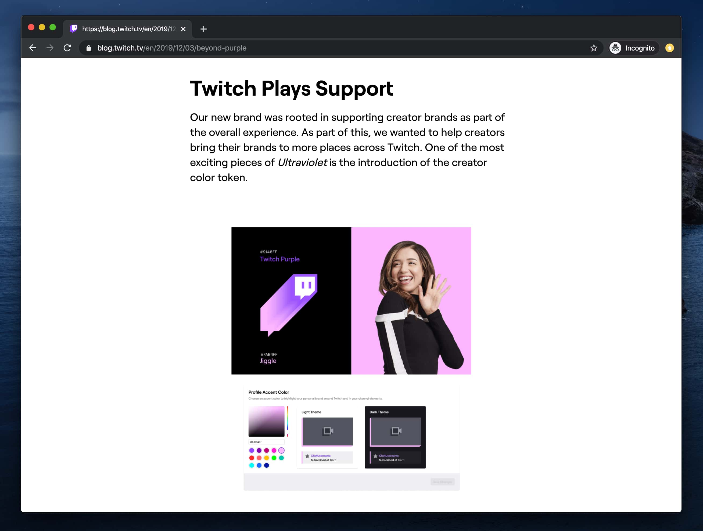

## Something Different

It's a beautiful spring Saturday here in Washington D.C. and as the warmer weather thankfully arrives in the mid-atlantic, chances are you're also experiencing something very different than your usual routine due to the COVID-19 pandemic. Wherever you are, whenever you're reading this, I hope you and your loved ones are safe and well. While I would usually be watching Newcastle United or playing pick-up soccer on a Saturday morning, neither of those hobbies of mine are options today, so as they say: "when life gives you lemons, catch up on your bookmarked reading list."

Though I'm not always able to keep up, I subscribe to a handful of newsletters—some of which are linked below—in an attempt to stay current in topics of interest: UX, UI design, and software development. Unfortunately though, once I'm done reading and the browser tab is closed, I soon find it difficult to retrieve that great content when the topic it discusses later comes up in conversation.

<highlight>

This actually happened just this past week with an amazing demo of [Facebook's internal design tooling](https://vimeo.com/242899818) from a talk given at a Sketch meetup a while back. Thankfully, one of my coworkers was able to find it from the vague description I was able to muster from memory—They've got skills. 

</highlight>

So, in an effort to make these things easier to find in the future, I'm going to start publishing roundups of 5-10 resources (articles, conference talks, GitHub repos) that caught my eye. If you find yourself enjoying the content, these roundup posts are conveniently published along with the rest of my blog posts in my [site's dedicated RSS feed](/rss.xml) so smash that subscribe button in your favorite RSS reader, if you're into that sort of thing.

With that said, let's see what we got goin' on this week 👀

## Top Highlight

If I had to pick a highlight this week, it would be **Twitch's [Beyond Purple](https://blog.twitch.tv/en/2019/12/03/beyond-purple) design system case study**. I currently work as a design system maintainer (or [gardener](https://daverupert.com/2020/01/the-web-is-industrialized-and-i-helped-industrialize-it/), whichever you prefer) so the elegance of their tokens implementation and their customizable creator colors really resonated with me.

## Articles

- [The State Reducer Pattern with React Hooks](https://kentcdodds.com/blog/the-state-reducer-pattern-with-react-hooks) 
- [Button Design — UI component series](https://uxdesign.cc/button-design-user-interface-components-series-85243b6736c7)
- [Design Tokens beyond colors, typography, and spacing.](https://badootech.badoo.com/design-tokens-beyond-colors-typography-and-spacing-ad7c98f4f228)
- [Creating Utility Classes with Design Tokens using Sass](https://www.alwaystwisted.com/articles/creating-utility-classes-with-design-tokens-using-sass)

<highlight>

This morning, I serendipitously came across Stu Robson's post describing how to use design tokens to generate utility classes. Great minds think alike obviously, I also maintain an open-source library, Skeletor, so you can [generate utility classes for your own system tokens](https://github.com/xdmorgan/skeletor/tree/master/packages/css). While the documentation is still a work in-progress, the best practical example of the library's use is this site which is [also open-source](https://github.com/xdmorgan/personal-site/blob/master/skeletor.yml).

</highlight>

## Videos 

- [How to build your first app with Contentful's new App Framework](https://www.contentful.com/resources/watch-build-your-first-app-contentful-new-app-framework/)
- [Hardcore Functional Programming in JavaScript, v2](https://frontendmasters.com/courses/hardcore-js-patterns/)
- [Hardcore Functional Architecture Patterns in JavaScript](https://frontendmasters.com/courses/hardcore-js-patterns/)
- [Pastry Chef Attempts to Make Gourmet Cadbury Creme Eggs](https://www.youtube.com/watch?v=3QqnhDI7VFA)

<highlight>

This week, I'm working through Brian Lonsdorf's new Front End Master's Hardcore Functional Programming course and already looking forward to the the advanced patterns course next. For an introduction to functional concepts in JavaScript, I would highly recommend Will Sentance's [Hard Parts: Functional JS Foundations](https://frontendmasters.com/teachers/will-sentance/) also on Front End masters (FEM subscription required).

</highlight>

## References & Sources

- [Kent Dodd's newsletter](https://kentcdodds.com/)
- [Design System News newsletter](http://news.design.systems/)