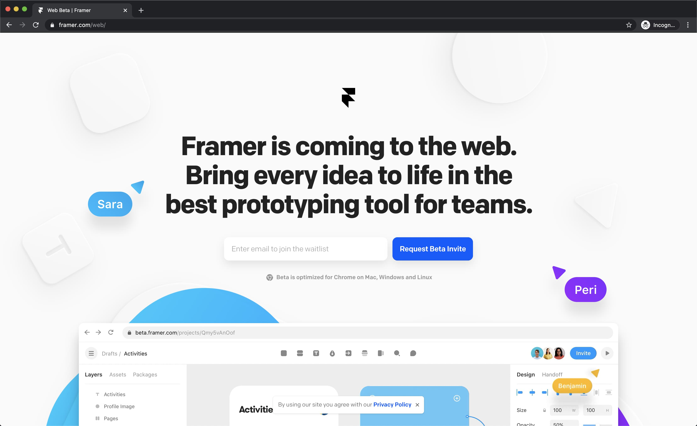

Since my last update, the brief glimpse of sunshine we were enjoying in the capital has quickly passed and cold rainy weather has returned to the <abbr title="D.C., Maryland, and Virginia">DMV</abbr>. With most people stuck indoors for a couple of months now, there is a ton of great content being produced and more time than usual to consume it. That said, this one is a bumper edition—Best to make a pot of coffee ☕️

## Top Highlight

Josh Comeau's article, [A Static Future](https://joshwcomeau.com/gatsby/a-static-future/), does a great job explaining the power of modern static site generators and clarifies some of the strengths and weaknesses of popular libraries like [Gatsby](https://www.gatsbyjs.org/) and [Next.js](https://nextjs.org/). It makes for a great introduction if you're new to the topic

## Design Systems

- **[“What Has Changed and Where’s it Going?” by Dave Rupert—An Event Apart video](https://aneventapart.com/news/post/what-has-changed-and-wheres-it-going-aea-video)**: A close runner up for my favorite piece of content this week, Dave's a great speaker and his presentation at An Event Apart here in DC is no exception. He discusses how advancements in browser support have made redundant some previously popular polyfills and support libraries in an effort to slim down page weights whose growth outpaces data limits and connection speeds.
- **[Layout-isolated Components](https://visly.app/blog/layout-isolated-components)**: Facebook's former 'flexbox guy', Emil Sjölander, argues against the use of several properties whose effects extend outside the bounds of a reusable component resulting in unpredictable and inconsistent behavior in different situations.

## CSS

- **[CSS Findings From the New Facebook Design](https://ishadeed.com/article/new-facebook-css/):** In-depth analysis of techniques used to build the new Facebook UI
- **[Reverse Engineering WhatsApp Web’s CSS](https://blog.animaapp.com/reverse-engineering-whatsapp-webs-css-9239293009f4):** Breakdown of some of the techniques used to build WhatsApp web and an accompanying [Codepen rebuild](https://codepen.io/elad2412/pen/wvaNyBv) as reference.
- **[Constrained CSS grids without max-width](https://ethanmarcotte.com/wrote/css-grid-without-max-width/):** Clever technique for contstraining grids with variable bookend-columns instead of a `max-width` setting.
- **[CSS for internationalisation](https://www.chenhuijing.com/blog/css-for-i18n):** Amazing deep-dive into HTML and CSS's i18n-friendly properties (e.g. dir, lang, logical-properties, writing-mode)
- **[98.css](https://jdan.github.io/98.css/#intro):** Who doesn't love a bit of nostalgia?

## JavaScript

- **[Introduction to Next.js 9](https://egghead.io/playlists/introduction-to-next-js-9-9c01)**: This Egghead course was a great way to jump back in after using Gatsby on a handful of recent projects. [Recently updated](https://nextjs.org/blog/next-9-3) to empower SSG workflows, my favorite part about Next has always been the way the maintainers put careful consideration into API design to simplify complex functionality into easy-to-use solutions like filename-based dynamic routes 🤯 (Egghead subscription required)
- **[Learn ES Modules in Node with Myles Borins](https://www.youtube.com/watch?v=qeCncjPWD1A):** Insightful walkthrough of Node's recently added ES Module support including self-referential imports and export maps.

<highlight>

**Speaking of Gatsby:** This site is one of those I recently built with Gatsby, it uses a custom theme (`gatsby-theme-xdmorgan`) to aggregate and configure popular Gatsby plugins (like a [toolkit dependency](https://kentcdodds.com/blog/concerning-toolkits)). This isolates dependency management, allows drop-in reuse on side-projects, and provides quickstart support for TypeScript, Sass, MDX, and other opinionated nice-to-haves. Check it out on [npm](https://www.npmjs.com/package/gatsby-theme-xdmorgan) and [GitHub](https://github.com/xdmorgan/gatsby-theme-xdmorgan).

</highlight>

## Tools

This week an invite for the [Framer Web beta](https://www.framer.com/web/) arrived in my inbox 📬 Being real-time and web-based, it will draw obvious comparisons with [Figma](https://www.figma.com/). As a code-backed prototyping tool, I'm interested to see how it can be integrated into a design systems component library workflow, more on that soon!

## Architecture

- **[Architecture Spotlight: Event Sourcing](https://www.sitepen.com/blog/architecture-spotlight-event-sourcing/)**: Simple explanation of the event sourcing pattern and how the storage of mutation events (instead of their outcomes) can result in an easily audited historical timeline of changes to saved data.

## Performance

- **[How to Prepare and Use Variable Fonts on the Web](https://thetrevorharmon.com/blog/how-to-prepare-and-use-variable-fonts-on-the-web):** Step-by-step guide to subsetting and providing fallbacks when migrating to variable fonts. Given this site also uses [Inter](https://rsms.me/inter/), I should probably get on that.
- **[Responsive Images the Simple Way](https://cloudfour.com/thinks/responsive-images-the-simple-way/)**: CloudFour have a few helpful guides to responsive images, this one concisely explains `srcset` and `sizes` attributes and how/when to use them with `` and `<picture />` elements.

## Conferences

- **[Jamstack Conf Virtual](https://www.netlify.com/blog/2020/04/16/announcing-jamstack-conf-virtual-schedule-and-registration/):** Organized by [Netlify](https://www.netlify.com/), the next Jamstack conf is going free virtual, see you there 👋

## Sources

- **[Sidebar](https://sidebar.io/):** Daily newsletter
- **[ESNext News](http://esnextnews.com/):** Weekly newsletter

<highlight>

Thanks for reading! Hopefully the next time I write one of these it will be [#cans](https://www.forbes.com/sites/harrydecosemo/2020/04/15/newcastle-united-fans-reaching-for-cans-as-takeover-gets-closer/#523a94d026aa) on tyneside. 🤞

</highlight>
